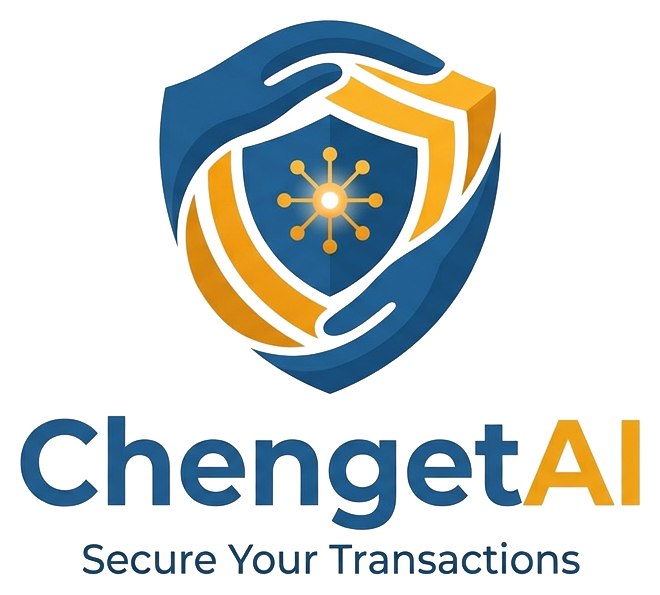

<p align="center">
  
</p>

# ChengetAI

**"Chengeta"** — Shona for *to protect / to guard*.

AI-powered scam & fraud protection for Zimbabwe: a mobile app for ordinary
Zimbabweans, SMEs, and mobile-money agents, built for the **AI4I 2026
(POTRAZ) challenge — Track 3: Development**.

> ChengetAI is a **product**: a scam-message detector, phone number
> reputation lookup, trending-scams feed, and an agent fraud dashboard. It
> is not a security-monitoring/compliance framework.

## The problem

Mobile money dominates everyday payments in Zimbabwe, and scam losses hit
the poorest hardest — eroding trust in digital finance just as the country
tries to deepen financial inclusion. Generic spam filters don't understand
Shona, code-switched Shona-English text, or EcoCash/OneMoney terminology,
so local scam scripts (EcoCash "wrong deposit" reversals, fake job offers,
fake forex deals, fake NGO/loan offers, church/prophet "seed" requests)
sail straight through them. There is also no shared, citizen-accessible
database of known scam numbers, and mobile-money agents/SMEs have no fraud
tooling of their own.

## What's in this MVP

| Module | What it does |
|---|---|
| **Check Message** | Paste or share a message; an AI classifier verdicts it scam / suspicious / safe with a plain-language explanation and highlighted risk phrases. |
| **Number Lookup** | Search a phone number for a community-sourced reputation: report count, scam categories, last reported. Report a number in-app. |
| **Trending Feed & Hotspot Map** | "Trending this week" scam categories and a province-level risk map (🟢/🟡/🔴), computed live from community reports with weighted rules — not AI, and the API says so explicitly. |
| **Agent Fraud Sentinel (B2B)** | Upload a mobile-money agent transaction CSV; get back flagged transactions (rapid reversals, structuring, unusual hours) with human-readable reasons. |
| **Landing page & Admin dashboard** | A Next.js web app (`web/`): a public marketing page (with live "trending this week" stats pulled from the API) and a password-gated admin dashboard for the report moderation queue, flagged-number review, and Sentinel job history. |

See `docs/architecture.md` for the full system diagram and an explicit
breakdown of where AI is used and where it deliberately isn't.

## Screenshots & demo

**All current screenshots, demo walkthroughs, and mobile app links are hosted on the live landing
page: [chengetai.vercel.app](https://chengetai.vercel.app)** — that page is the single reference
point for judges going forward, rather than duplicating images across this README and the proposal.

A historical local set (`docs/screenshots/`: `landing-page.png`, `admin-overview.png`,
`admin-reports.png`, `admin-sentinel.png`, `admin-numbers.png`, `admin-login.png`) remains in the
repo for reference, captured against a running backend with real seeded/uploaded data, not mockups.

## Repository layout

```
chengetai/
├── app/            # Flutter app (Android-first), feature-first structure
├── web/             # Next.js landing page + admin dashboard
├── backend/         # Python FastAPI backend
│   └── tests/        # pytest suite (classifier, reputation, feed, sentinel, API)
├── sample_data/     # Synthetic scam corpus + transaction data, generation scripts, Supabase seed.sql
├── docs/            # Architecture, API reference, dataset statement, screenshots
├── proposal/         # AI4I 2026 Track 3 proposal document
└── .github/workflows/ci.yml  # backend pytest + web build/lint on every push
```

## Running the backend

```bash
cd backend
python3 -m venv .venv && source .venv/bin/activate
pip install -r requirements.txt
cp .env.example .env   # defaults work out of the box: in-memory store, baseline classifier, console SMS

uvicorn app.main:app --reload
# API now at http://localhost:8000, interactive docs at http://localhost:8000/docs
```

No Supabase project or Anthropic API key is required to run the full API
surface: the backend defaults to an in-memory store (`USE_SUPABASE=false`,
seeded with sample reports/feed items) and the TF-IDF/LogisticRegression
baseline classifier (`CLASSIFIER_STRATEGY=baseline`). Set `USE_SUPABASE=true`
plus Supabase credentials to use a real Postgres project (schema in
`sample_data/seed.sql`), and `CLASSIFIER_STRATEGY=llm` plus
`ANTHROPIC_API_KEY` to use the Anthropic-backed classifier (the API
gracefully falls back to the baseline if the key is missing).

Run the test suite:

```bash
cd backend && .venv/bin/pytest -q   # 22 tests: classifier, reputation, feed, sentinel, API
```

Regenerate the synthetic sample data (already committed, regeneration is
optional):

```bash
python3 sample_data/generate_scam_corpus.py
python3 sample_data/generate_transactions.py
```

## Running the app

```bash
cd app
# Platform folders (android/, ios/) aren't checked in, so they scaffold
# cleanly against whatever Flutter/AGP/Kotlin version you have locally:
flutter create . --org com.chengetai --project-name chengetai
# Then confirm android/app/src/main/AndroidManifest.xml has the INTERNET
# permission (every screen talks to the backend):
#   <uses-permission android:name="android.permission.INTERNET" />

flutter pub get
# Android emulator talks to the backend at http://10.0.2.2:8000 by default
# (see app/lib/core/constants.dart) — override with --dart-define for a
# physical device or a deployed backend URL.
flutter run
```

The app was written and reviewed without a Flutter SDK available in this
environment (no `flutter pub get`/`analyze`/`run` was possible here) — do a
first-build check of `fl_chart` tooltip callback signatures and Material
icon names (`gpp_bad_outlined`, `shield_moon_outlined`) against your
installed SDK version.

## Running the web app (landing page + admin dashboard)

```bash
cd web
npm install
cp .env.example .env.local   # set ADMIN_PASSWORD; CHENGETAI_API_BASE_URL defaults to localhost:8000
npm run dev
# Landing page at http://localhost:3000, admin dashboard at http://localhost:3000/admin
```

Requires the backend running (above) to render live data — the landing
page's stats section and every `/admin/*` page will show a "backend
unreachable" notice instead of crashing if it isn't. The admin dashboard is
gated by a single shared `ADMIN_PASSWORD` (see `docs/architecture.md` →
"Admin dashboard auth" for why, and the roadmap to real Supabase Auth).

## Demo script

1. **Check Message**: paste an EcoCash "wrong deposit" style message → see
   a `scam` verdict with highlighted risk phrases and an explanation → tap
   *Report this number*.
2. **Number Lookup**: search `0771234567` (seeded sample data) → see its
   report history and risk level.
3. **Feed**: open the Alerts tab → see the seeded trending items, then the
   live "Trending This Week" list and province hotspot map built from the
   same reports.
4. **Sentinel**: upload `sample_data/transactions_sample.csv` → see flagged
   transactions with reasons (structuring, rapid reversal, unusual hours).
5. **Landing page**: open `http://localhost:3000` → see the live "trending
   this week" stats pulled from the same API.
6. **Admin dashboard**: log in at `http://localhost:3000/admin/login` → see
   the same reports/numbers/Sentinel data from an internal, table-based view.

## AI justification (summary)

- **Message classification** needs AI because scam text is adversarial,
  code-switched, and constantly mutating — a keyword blocklist catches
  yesterday's scripts, not tomorrow's. The repo ships both a trained
  baseline and an LLM strategy specifically so this trade-off is
  demonstrable (`docs/architecture.md`).
- **Sentinel anomaly detection** needs AI because agent fraud patterns are
  unlabeled and drift over time — unsupervised learning (IsolationForest)
  is the appropriate tool, paired with explicit rules as an honest baseline.
- **Number reputation** and the **trending feed/hotspot map** are
  deliberately plain CRUD and weighted-rules aggregation, not AI — see
  `docs/architecture.md` for why, and the `/feed/trending` response's
  `method_note` field, which says so at runtime.

## Known limitations (MVP scope)

- Both sample datasets (`sample_data/`) are **synthetic**, disclosed in
  `docs/dataset_statement.md` — not real user messages or real transactions.
- No live SMS interception (Android share-intent / manual paste only in
  this MVP), no iOS build, no telco integrations, no real payments, no real
  bank data. See the roadmap in `proposal/ChengetAI_AI4I_Proposal_Development.md`.
- Auth is a minimal Supabase-auth stub in the Flutter app pending a real
  Supabase project; the backend's `SupabaseStore` is implemented and tested
  against the schema but not exercised against a live project in this repo.
- The reputation system's abuse controls (rate limiting, duplicate
  collapse, public-flag threshold) are implemented and unit-tested, but a
  full human-review dispute flow is roadmap, not MVP.
- The admin dashboard (`web/`) uses a single shared password, not per-admin
  Supabase Auth accounts; the three list endpoints it reads from
  (`/numbers`, `/reports`, `/sentinel/jobs`) are not themselves auth-gated
  on the backend in this MVP (see `docs/architecture.md` → "Admin dashboard
  auth").

## Live demo

**[chengetai.vercel.app](https://chengetai.vercel.app)** — the deployed landing page, and the
single evidence hub for screenshots, demo walkthroughs, and mobile app links referenced from the
proposal.

## Docs

- `docs/architecture.md` — system diagram, AI justification, offline
  behaviour, abuse-resistance design
- `docs/api.md` — full API reference
- `docs/dataset_statement.md` — dataset provenance, validation, privacy notes
- `docs/business_model_summary.md` — one-page business model summary (ToR Annex A)
- `docs/deployment_plan.md` — hosting, operator, support, monitoring, backup/recovery,
  scale pathway (ToR Annex B)
- `docs/risk_compliance_checklist.md` — standalone privacy/security/bias/misuse checklist
- `docs/accessibility.md` — contrast, font size, low-bandwidth, and language considerations
- `docs/usability_testing.md` — internal testing log and planned pilot usability protocol
- `docs/pitch_deck_outline.md` — pitch deck content plan
- `docs/assets/` — logo source files (`logo-mark.png` icon-only, `logo-horizontal.png`
  icon+wordmark, `logo-full.png` icon+wordmark+tagline), reused as-is by the
  Flutter app (`app/assets/branding/`), the web app (`web/public/`,
  `web/src/app/icon.png`), and this README
- `proposal/ChengetAI_AI4I_Proposal_Development.md` — the formal AI4I 2026
  Track 3 submission
